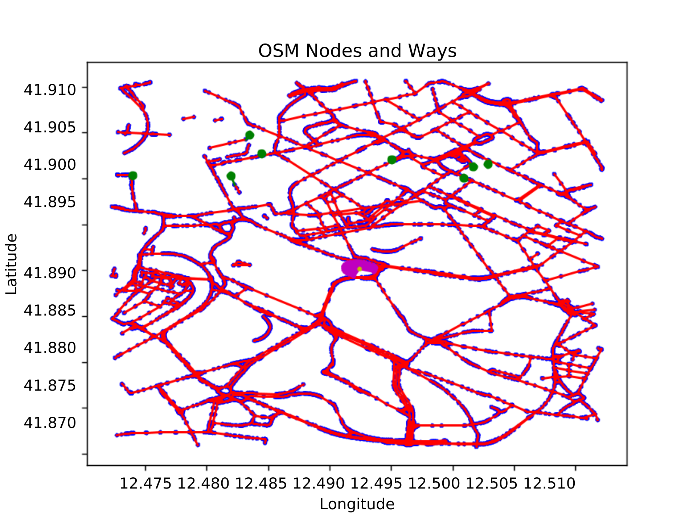

# CPT_S 453 Graph Theory Final Project Code Implementation  
Final project for CPT_S 453 at WSU-TC Fall 2024  



## Files  
All required files are included in the github repository. These files include:  
- aStar.py  
- bellman-ford.algorithm.py  
- dijkstras.algorithm.py  
- WeightedGraph.py    
- rome_italy.pkl  
- rome_italy.pkl:Zone.Identifier  

### WeightedGraph.py  
This file includes the implementation for creating a graph from a .pkl file containing map data.  

### aStar.py  
This file includes the implementation of the A* algorithm as well as the logic to run the algorithm on the graph created from rome_italy.pkl. The algorithm will run from the Colosseum vertex (8430) to each of the McDonald's vertices(8389, 8390, 8391, 8392, 8393, 8394, 8395, 8396), and return the path, the time to find that path, and the distance of the path.  

### bellman-ford.algorithm.py
This file includes the implementation of the Bellman Ford algorithm as well as the logic to run the algorithm on the graph created from rome_italy.pkl. The algorithm will run from the Colosseum vertex (8430) to each of the McDonald's vertices(8389, 8390, 8391, 8392, 8393, 8394, 8395, 8396), and return the path, the time to find that path, and the distance of the path. The algorithm will run with or without a set destination vertex, finding a shortest path to all of the vertices in the graph. 

### dijkstras.algorithm.py  
This file includes the implementation of Dijkstra's algorithm as well as the logic to run the algorithm on the graph created from rome_italy.pkl. The algorithm will run from the Colosseum vertex (8430) to each of the McDonald's vertices(8389, 8390, 8391, 8392, 8393, 8394, 8395, 8396), and return the path, the time to find that path, and the distance of the path. The algorithm will run with or without a set destination vertex, finding a shortest path to all of the vertices in the graph.

### rome_italy.pkl  
This file includes all of the map data points.  

## Tutorial 
From the command line in the terminal,
1. navigate to the directory in which all files reside.  
2. ensure the aStar.py, bellman-ford.algorithm.py, and dijkstras.algorithm.py files are all executable files.  
&emsp;- you may have to run chmod +x \<file name\> in order to change this  
3. files may be run by entering the following on the command line:  
```
python <file name>  
``` 
4. results will be printed to the terminal window.
